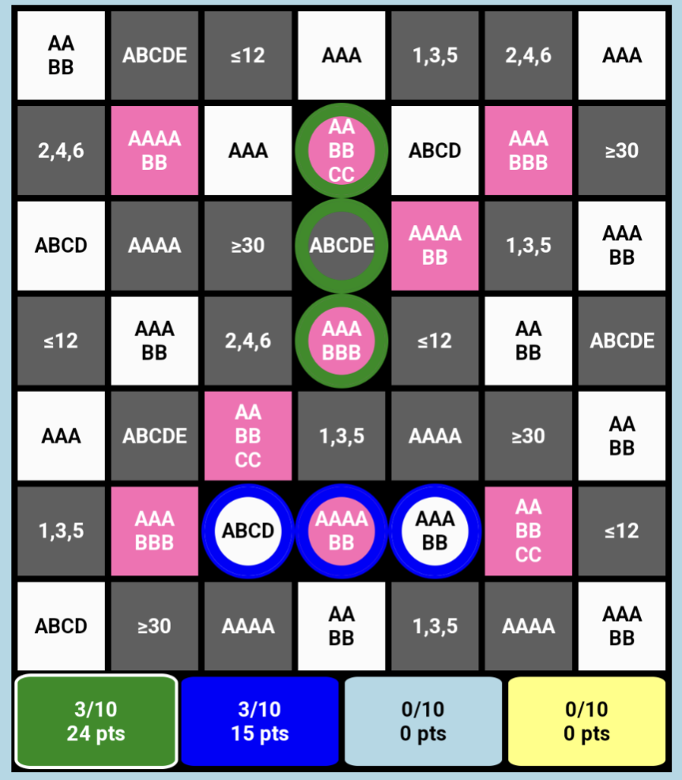

# KiviCntr

https://tomakela.github.io/KiviCntr/

My old manual score counter for a board game Kivi: https://boardgamegeek.com/boardgame/206851/kivi . PWA enabled and tested on Android. Alternatively, "laskuri.html" should work as a standalone file

Icon/favicon from https://fonts.google.com/icons released under Apache License Version 2.0

## Note:

Assumes portrait screen. On PC: install PWA and make the window less wide than high.
